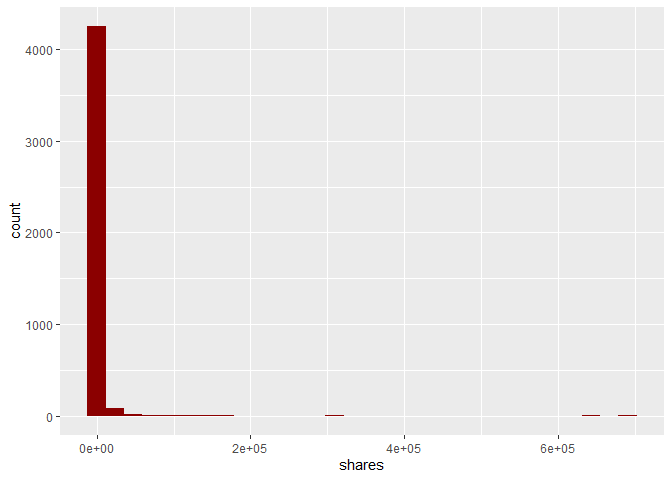
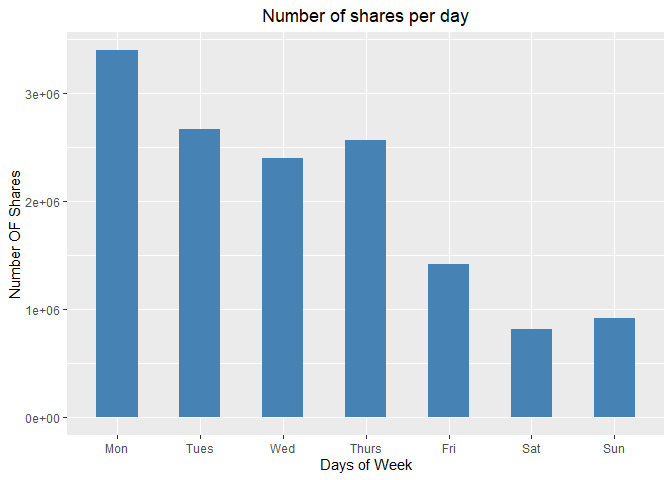
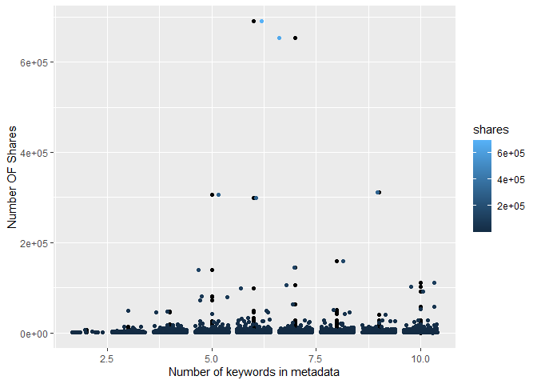
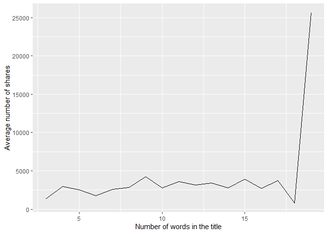
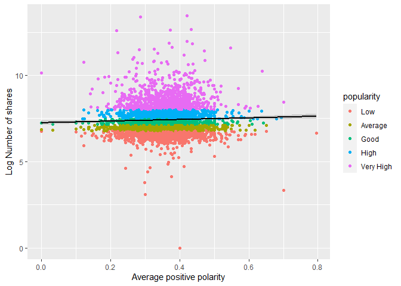
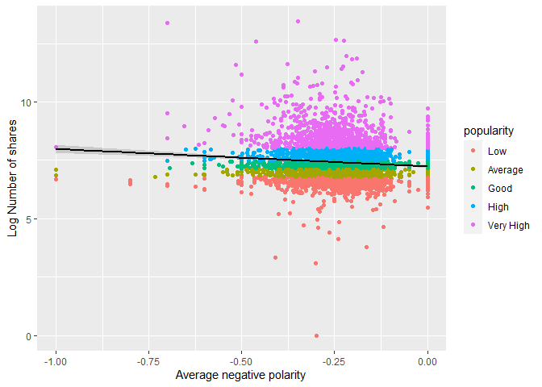
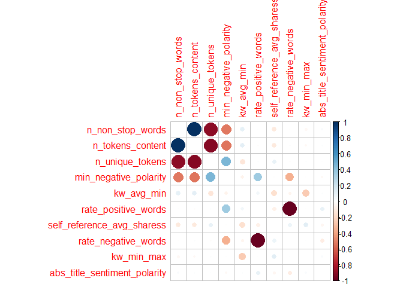
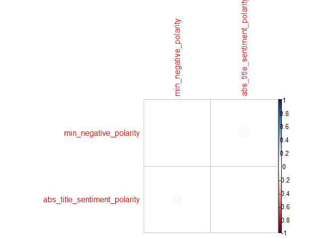
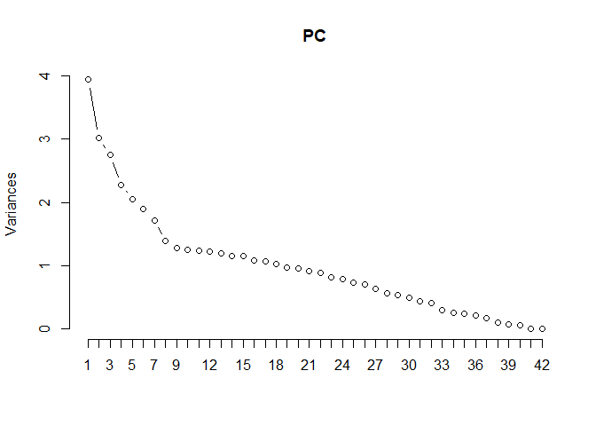

Project 3: Predicting online news popularity
================
Rohan Prabhune, Manan Shah

-   <a href="#introduction" id="toc-introduction">Introduction</a>
-   <a href="#loading-the-necessary-packages"
    id="toc-loading-the-necessary-packages">Loading the necessary
    packages</a>
-   <a href="#reading-the-data" id="toc-reading-the-data">Reading the
    data:</a>
-   <a href="#pre-processing" id="toc-pre-processing">Pre-processing:</a>
    -   <a href="#subset-data-based-on-type-of-article"
        id="toc-subset-data-based-on-type-of-article">Subset data based on type
        of article</a>
    -   <a href="#spliting-the-data-into-train-and-test-set"
        id="toc-spliting-the-data-into-train-and-test-set">Spliting the data
        into train and test set</a>
-   <a href="#summarizations" id="toc-summarizations">Summarizations</a>
    -   <a href="#summary-tables" id="toc-summary-tables">Summary tables</a>
    -   <a href="#contingency-tables" id="toc-contingency-tables">Contingency
        tables</a>
    -   <a href="#plots" id="toc-plots">Plots</a>
-   <a href="#modeling" id="toc-modeling">Modeling</a>
    -   <a href="#linear-regression" id="toc-linear-regression">Linear
        regression</a>
        -   <a href="#forward-selection" id="toc-forward-selection">Forward
            Selection</a>
        -   <a href="#backward-selection" id="toc-backward-selection">Backward
            Selection</a>
    -   <a href="#ensemble-tree-based-models"
        id="toc-ensemble-tree-based-models">Ensemble Tree-Based Models</a>
        -   <a href="#random-forest" id="toc-random-forest">Random Forest</a>
        -   <a href="#boosting" id="toc-boosting">Boosting</a>
-   <a href="#model-evaluation-on-test-set"
    id="toc-model-evaluation-on-test-set">Model evaluation on test set</a>

# Introduction

# Loading the necessary packages

``` r
library(tidyverse)
library(caret)
library(kableExtra)
library(corrplot)
library(timereg)
```

# Reading the data:

*Citation for the dataset:  
K. Fernandes, P. Vinagre and P. Cortez. A Proactive Intelligent Decision
Support System for Predicting the Popularity of Online News. Proceedings
of the 17th EPIA 2015 - Portuguese Conference on Artificial
Intelligence, September, Coimbra, Portugal.*

``` r
#Reading the data
print(params$var)
```

    ## [1] "bus"

``` r
dataset <- read_csv("data/OnlineNewsPopularity.csv",show_col_types=FALSE) 
dataset
```

    ## # A tibble: 39,644 × 61
    ##    url        timed…¹ n_tok…² n_tok…³ n_uni…⁴ n_non…⁵ n_non…⁶ num_h…⁷ num_s…⁸ num_i…⁹ num_v…˟ avera…˟ num_k…˟
    ##    <chr>        <dbl>   <dbl>   <dbl>   <dbl>   <dbl>   <dbl>   <dbl>   <dbl>   <dbl>   <dbl>   <dbl>   <dbl>
    ##  1 http://ma…     731      12     219   0.664    1.00   0.815       4       2       1       0    4.68       5
    ##  2 http://ma…     731       9     255   0.605    1.00   0.792       3       1       1       0    4.91       4
    ##  3 http://ma…     731       9     211   0.575    1.00   0.664       3       1       1       0    4.39       6
    ##  4 http://ma…     731       9     531   0.504    1.00   0.666       9       0       1       0    4.40       7
    ##  5 http://ma…     731      13    1072   0.416    1.00   0.541      19      19      20       0    4.68       7
    ##  6 http://ma…     731      10     370   0.560    1.00   0.698       2       2       0       0    4.36       9
    ##  7 http://ma…     731       8     960   0.418    1.00   0.550      21      20      20       0    4.65      10
    ##  8 http://ma…     731      12     989   0.434    1.00   0.572      20      20      20       0    4.62       9
    ##  9 http://ma…     731      11      97   0.670    1.00   0.837       2       0       0       0    4.86       7
    ## 10 http://ma…     731      10     231   0.636    1.00   0.797       4       1       1       1    5.09       5
    ## # … with 39,634 more rows, 48 more variables: data_channel_is_lifestyle <dbl>,
    ## #   data_channel_is_entertainment <dbl>, data_channel_is_bus <dbl>, data_channel_is_socmed <dbl>,
    ## #   data_channel_is_tech <dbl>, data_channel_is_world <dbl>, kw_min_min <dbl>, kw_max_min <dbl>,
    ## #   kw_avg_min <dbl>, kw_min_max <dbl>, kw_max_max <dbl>, kw_avg_max <dbl>, kw_min_avg <dbl>,
    ## #   kw_max_avg <dbl>, kw_avg_avg <dbl>, self_reference_min_shares <dbl>, self_reference_max_shares <dbl>,
    ## #   self_reference_avg_sharess <dbl>, weekday_is_monday <dbl>, weekday_is_tuesday <dbl>,
    ## #   weekday_is_wednesday <dbl>, weekday_is_thursday <dbl>, weekday_is_friday <dbl>, …

# Pre-processing:

## Subset data based on type of article

``` r
# Vector of columns other than data_channel_is*
remaining_cols = c(names(dataset))[c(1:13,20:61)]
# Subset based on type of article
input_data_channel = params$var
select_var = paste0("data_channel_is_",input_data_channel)
subset_cols = append(remaining_cols,select_var)
# Subset data
df <- dataset %>% select(all_of(subset_cols)) %>%
  filter(dataset[select_var] == 1) %>%
  select(all_of(remaining_cols))
```

Removing url and timedelta as they are non-predictive variables. Filter
the tibble based on n_tokens_content and n_tokens_title that is, where
number of words in the content and title are not zero.

``` r
#Remove url and timedelta and filter on data
df <- df %>% select(-url,-timedelta) %>% filter(n_tokens_content!=0,n_tokens_title!=0)
df
```

    ## # A tibble: 6,235 × 53
    ##    n_tokens…¹ n_tok…² n_uni…³ n_non…⁴ n_non…⁵ num_h…⁶ num_s…⁷ num_i…⁸ num_v…⁹ avera…˟ num_k…˟ kw_mi…˟ kw_ma…˟
    ##         <dbl>   <dbl>   <dbl>   <dbl>   <dbl>   <dbl>   <dbl>   <dbl>   <dbl>   <dbl>   <dbl>   <dbl>   <dbl>
    ##  1          9     255   0.605    1.00   0.792       3       1       1       0    4.91       4       0       0
    ##  2          9     211   0.575    1.00   0.664       3       1       1       0    4.39       6       0       0
    ##  3          8     397   0.625    1.00   0.806      11       0       1       0    5.45       6       0       0
    ##  4         13     244   0.560    1.00   0.680       3       2       1       0    4.42       4       0       0
    ##  5         11     723   0.491    1.00   0.642      18       1       1       0    5.23       6       0       0
    ##  6          8     708   0.482    1.00   0.688       8       3       1       1    4.62       7       0       0
    ##  7         10     142   0.655    1.00   0.792       2       1       1       0    4.27       5       0       0
    ##  8         12     444   0.601    1.00   0.755       9       8      23       0    4.81      10       0       0
    ##  9          6     109   0.667    1.00   0.737       3       2       1       0    4.73       6       0       0
    ## 10         13     306   0.535    1.00   0.705       3       2       1       0    4.58      10     217    5700
    ## # … with 6,225 more rows, 40 more variables: kw_avg_min <dbl>, kw_min_max <dbl>, kw_max_max <dbl>,
    ## #   kw_avg_max <dbl>, kw_min_avg <dbl>, kw_max_avg <dbl>, kw_avg_avg <dbl>, self_reference_min_shares <dbl>,
    ## #   self_reference_max_shares <dbl>, self_reference_avg_sharess <dbl>, weekday_is_monday <dbl>,
    ## #   weekday_is_tuesday <dbl>, weekday_is_wednesday <dbl>, weekday_is_thursday <dbl>,
    ## #   weekday_is_friday <dbl>, weekday_is_saturday <dbl>, weekday_is_sunday <dbl>, is_weekend <dbl>,
    ## #   LDA_00 <dbl>, LDA_01 <dbl>, LDA_02 <dbl>, LDA_03 <dbl>, LDA_04 <dbl>, global_subjectivity <dbl>,
    ## #   global_sentiment_polarity <dbl>, global_rate_positive_words <dbl>, global_rate_negative_words <dbl>, …

``` r
names(df)
```

    ##  [1] "n_tokens_title"               "n_tokens_content"             "n_unique_tokens"             
    ##  [4] "n_non_stop_words"             "n_non_stop_unique_tokens"     "num_hrefs"                   
    ##  [7] "num_self_hrefs"               "num_imgs"                     "num_videos"                  
    ## [10] "average_token_length"         "num_keywords"                 "kw_min_min"                  
    ## [13] "kw_max_min"                   "kw_avg_min"                   "kw_min_max"                  
    ## [16] "kw_max_max"                   "kw_avg_max"                   "kw_min_avg"                  
    ## [19] "kw_max_avg"                   "kw_avg_avg"                   "self_reference_min_shares"   
    ## [22] "self_reference_max_shares"    "self_reference_avg_sharess"   "weekday_is_monday"           
    ## [25] "weekday_is_tuesday"           "weekday_is_wednesday"         "weekday_is_thursday"         
    ## [28] "weekday_is_friday"            "weekday_is_saturday"          "weekday_is_sunday"           
    ## [31] "is_weekend"                   "LDA_00"                       "LDA_01"                      
    ## [34] "LDA_02"                       "LDA_03"                       "LDA_04"                      
    ## [37] "global_subjectivity"          "global_sentiment_polarity"    "global_rate_positive_words"  
    ## [40] "global_rate_negative_words"   "rate_positive_words"          "rate_negative_words"         
    ## [43] "avg_positive_polarity"        "min_positive_polarity"        "max_positive_polarity"       
    ## [46] "avg_negative_polarity"        "min_negative_polarity"        "max_negative_polarity"       
    ## [49] "title_subjectivity"           "title_sentiment_polarity"     "abs_title_subjectivity"      
    ## [52] "abs_title_sentiment_polarity" "shares"

## Spliting the data into train and test set

``` r
set.seed(52)
# Get the indexes for training data
train_size <- sample(nrow(df), nrow(df)*0.7)
# Get training data
train_df <- df[train_size,]
# Get test data
test_df <- df[-train_size,] 
```

# Summarizations

## Summary tables

``` r
# Creating summaries for some numerical variables
df_summary <- train_df %>%
  select(num_imgs,num_videos,num_hrefs,n_unique_tokens, num_videos,num_keywords,
         global_rate_positive_words,global_rate_negative_words)
predictor_table <- apply(df_summary, MARGIN = 2,FUN = summary, na.rm = TRUE)
predictor_table %>%
  kbl(caption="Summary table for predictor variables") %>%
  kable_classic(full_width = F)
```

<table class=" lightable-classic" style="font-family: &quot;Arial Narrow&quot;, &quot;Source Sans Pro&quot;, sans-serif; width: auto !important; margin-left: auto; margin-right: auto;">
<caption>
Summary table for predictor variables
</caption>
<thead>
<tr>
<th style="text-align:left;">
</th>
<th style="text-align:right;">
num_imgs
</th>
<th style="text-align:right;">
num_videos
</th>
<th style="text-align:right;">
num_hrefs
</th>
<th style="text-align:right;">
n_unique_tokens
</th>
<th style="text-align:right;">
num_keywords
</th>
<th style="text-align:right;">
global_rate_positive_words
</th>
<th style="text-align:right;">
global_rate_negative_words
</th>
</tr>
</thead>
<tbody>
<tr>
<td style="text-align:left;">
Min.
</td>
<td style="text-align:right;">
0.000000
</td>
<td style="text-align:right;">
0.000000
</td>
<td style="text-align:right;">
0.000000
</td>
<td style="text-align:right;">
0.2609953
</td>
<td style="text-align:right;">
2.000000
</td>
<td style="text-align:right;">
0.0000000
</td>
<td style="text-align:right;">
0.0000000
</td>
</tr>
<tr>
<td style="text-align:left;">
1st Qu.
</td>
<td style="text-align:right;">
1.000000
</td>
<td style="text-align:right;">
0.000000
</td>
<td style="text-align:right;">
4.000000
</td>
<td style="text-align:right;">
0.4785764
</td>
<td style="text-align:right;">
5.000000
</td>
<td style="text-align:right;">
0.0327766
</td>
<td style="text-align:right;">
0.0090909
</td>
</tr>
<tr>
<td style="text-align:left;">
Median
</td>
<td style="text-align:right;">
1.000000
</td>
<td style="text-align:right;">
0.000000
</td>
<td style="text-align:right;">
7.000000
</td>
<td style="text-align:right;">
0.5471194
</td>
<td style="text-align:right;">
6.000000
</td>
<td style="text-align:right;">
0.0428571
</td>
<td style="text-align:right;">
0.0139860
</td>
</tr>
<tr>
<td style="text-align:left;">
Mean
</td>
<td style="text-align:right;">
1.826535
</td>
<td style="text-align:right;">
0.673923
</td>
<td style="text-align:right;">
9.430339
</td>
<td style="text-align:right;">
0.5475176
</td>
<td style="text-align:right;">
6.484418
</td>
<td style="text-align:right;">
0.0436086
</td>
<td style="text-align:right;">
0.0147766
</td>
</tr>
<tr>
<td style="text-align:left;">
3rd Qu.
</td>
<td style="text-align:right;">
1.000000
</td>
<td style="text-align:right;">
0.000000
</td>
<td style="text-align:right;">
12.000000
</td>
<td style="text-align:right;">
0.6115312
</td>
<td style="text-align:right;">
8.000000
</td>
<td style="text-align:right;">
0.0538922
</td>
<td style="text-align:right;">
0.0193705
</td>
</tr>
<tr>
<td style="text-align:left;">
Max.
</td>
<td style="text-align:right;">
51.000000
</td>
<td style="text-align:right;">
75.000000
</td>
<td style="text-align:right;">
97.000000
</td>
<td style="text-align:right;">
0.8732394
</td>
<td style="text-align:right;">
10.000000
</td>
<td style="text-align:right;">
0.1250000
</td>
<td style="text-align:right;">
0.0588235
</td>
</tr>
</tbody>
</table>

``` r
response_table <- as.array(summary(train_df$shares))
response_table %>%
  kbl(caption="Summary table for response variable") %>%
  kable_classic(full_width = F)
```

<table class=" lightable-classic" style="font-family: &quot;Arial Narrow&quot;, &quot;Source Sans Pro&quot;, sans-serif; width: auto !important; margin-left: auto; margin-right: auto;">
<caption>
Summary table for response variable
</caption>
<thead>
<tr>
<th style="text-align:left;">
Var1
</th>
<th style="text-align:right;">
Freq
</th>
</tr>
</thead>
<tbody>
<tr>
<td style="text-align:left;">
Min.
</td>
<td style="text-align:right;">
1.000
</td>
</tr>
<tr>
<td style="text-align:left;">
1st Qu.
</td>
<td style="text-align:right;">
954.000
</td>
</tr>
<tr>
<td style="text-align:left;">
Median
</td>
<td style="text-align:right;">
1400.000
</td>
</tr>
<tr>
<td style="text-align:left;">
Mean
</td>
<td style="text-align:right;">
3245.892
</td>
</tr>
<tr>
<td style="text-align:left;">
3rd Qu.
</td>
<td style="text-align:right;">
2500.000
</td>
</tr>
<tr>
<td style="text-align:left;">
Max.
</td>
<td style="text-align:right;">
690400.000
</td>
</tr>
</tbody>
</table>

## Contingency tables

``` r
# Create a categorical "day" column
train_df$day <- ifelse(train_df$weekday_is_monday == 1, "Mon",
                ifelse(train_df$weekday_is_tuesday == 1, "Tues",
                ifelse(train_df$weekday_is_wednesday == 1, "Wed", 
                ifelse(train_df$weekday_is_thursday == 1, "Thurs",
                ifelse(train_df$weekday_is_friday == 1, "Fri",
                ifelse(train_df$weekday_is_saturday == 1, "Sat",
                ifelse(train_df$weekday_is_sunday == 1, "Sun","NA")))))))
train_df$day <- ordered(as.factor(train_df$day),
                        levels = c("Mon","Tues","Wed","Thurs","Fri","Sat","Sun"))

# Create a categorical "image_grouped" column
train_df$image_grouped <- ifelse(train_df$num_imgs %in% c(0:25), "1-25",
                          ifelse(train_df$num_imgs %in% c(26:50), "26-50",
                          ifelse(train_df$num_imgs %in% c(51:75), "51-75",
                          ifelse(train_df$num_imgs %in% c(76:101), "76-100","100+"))))
train_df$image_grouped <- ordered(as.factor(train_df$image_grouped),
                        levels = c("1-25","26-50","51-75","76-100","100+"))

# Contingency table between day and image_grouped
contingency_1 <- table(train_df$day,train_df$image_grouped)
contingency_1 %>%
  kbl(caption="Table for Days and Number of Images") %>%
  kable_classic(full_width = F)
```

<table class=" lightable-classic" style="font-family: &quot;Arial Narrow&quot;, &quot;Source Sans Pro&quot;, sans-serif; width: auto !important; margin-left: auto; margin-right: auto;">
<caption>
Table for Days and Number of Images
</caption>
<thead>
<tr>
<th style="text-align:left;">
</th>
<th style="text-align:right;">
1-25
</th>
<th style="text-align:right;">
26-50
</th>
<th style="text-align:right;">
51-75
</th>
<th style="text-align:right;">
76-100
</th>
<th style="text-align:right;">
100+
</th>
</tr>
</thead>
<tbody>
<tr>
<td style="text-align:left;">
Mon
</td>
<td style="text-align:right;">
796
</td>
<td style="text-align:right;">
5
</td>
<td style="text-align:right;">
0
</td>
<td style="text-align:right;">
0
</td>
<td style="text-align:right;">
0
</td>
</tr>
<tr>
<td style="text-align:left;">
Tues
</td>
<td style="text-align:right;">
816
</td>
<td style="text-align:right;">
4
</td>
<td style="text-align:right;">
0
</td>
<td style="text-align:right;">
0
</td>
<td style="text-align:right;">
0
</td>
</tr>
<tr>
<td style="text-align:left;">
Wed
</td>
<td style="text-align:right;">
871
</td>
<td style="text-align:right;">
3
</td>
<td style="text-align:right;">
0
</td>
<td style="text-align:right;">
0
</td>
<td style="text-align:right;">
0
</td>
</tr>
<tr>
<td style="text-align:left;">
Thurs
</td>
<td style="text-align:right;">
875
</td>
<td style="text-align:right;">
2
</td>
<td style="text-align:right;">
0
</td>
<td style="text-align:right;">
0
</td>
<td style="text-align:right;">
0
</td>
</tr>
<tr>
<td style="text-align:left;">
Fri
</td>
<td style="text-align:right;">
582
</td>
<td style="text-align:right;">
2
</td>
<td style="text-align:right;">
0
</td>
<td style="text-align:right;">
0
</td>
<td style="text-align:right;">
0
</td>
</tr>
<tr>
<td style="text-align:left;">
Sat
</td>
<td style="text-align:right;">
169
</td>
<td style="text-align:right;">
1
</td>
<td style="text-align:right;">
0
</td>
<td style="text-align:right;">
0
</td>
<td style="text-align:right;">
0
</td>
</tr>
<tr>
<td style="text-align:left;">
Sun
</td>
<td style="text-align:right;">
237
</td>
<td style="text-align:right;">
0
</td>
<td style="text-align:right;">
1
</td>
<td style="text-align:right;">
0
</td>
<td style="text-align:right;">
0
</td>
</tr>
</tbody>
</table>

``` r
# Contingency table between day and num_keywords
contingency_2 <- table(as.factor(train_df$day), as.factor(train_df$num_keywords))
contingency_2 %>%
  kbl(caption="Table for Days and Number of Keywords") %>%
  kable_classic(full_width = F)
```

<table class=" lightable-classic" style="font-family: &quot;Arial Narrow&quot;, &quot;Source Sans Pro&quot;, sans-serif; width: auto !important; margin-left: auto; margin-right: auto;">
<caption>
Table for Days and Number of Keywords
</caption>
<thead>
<tr>
<th style="text-align:left;">
</th>
<th style="text-align:right;">
2
</th>
<th style="text-align:right;">
3
</th>
<th style="text-align:right;">
4
</th>
<th style="text-align:right;">
5
</th>
<th style="text-align:right;">
6
</th>
<th style="text-align:right;">
7
</th>
<th style="text-align:right;">
8
</th>
<th style="text-align:right;">
9
</th>
<th style="text-align:right;">
10
</th>
</tr>
</thead>
<tbody>
<tr>
<td style="text-align:left;">
Mon
</td>
<td style="text-align:right;">
2
</td>
<td style="text-align:right;">
22
</td>
<td style="text-align:right;">
91
</td>
<td style="text-align:right;">
161
</td>
<td style="text-align:right;">
180
</td>
<td style="text-align:right;">
134
</td>
<td style="text-align:right;">
80
</td>
<td style="text-align:right;">
57
</td>
<td style="text-align:right;">
74
</td>
</tr>
<tr>
<td style="text-align:left;">
Tues
</td>
<td style="text-align:right;">
4
</td>
<td style="text-align:right;">
22
</td>
<td style="text-align:right;">
107
</td>
<td style="text-align:right;">
155
</td>
<td style="text-align:right;">
168
</td>
<td style="text-align:right;">
113
</td>
<td style="text-align:right;">
98
</td>
<td style="text-align:right;">
65
</td>
<td style="text-align:right;">
88
</td>
</tr>
<tr>
<td style="text-align:left;">
Wed
</td>
<td style="text-align:right;">
3
</td>
<td style="text-align:right;">
36
</td>
<td style="text-align:right;">
111
</td>
<td style="text-align:right;">
177
</td>
<td style="text-align:right;">
181
</td>
<td style="text-align:right;">
122
</td>
<td style="text-align:right;">
92
</td>
<td style="text-align:right;">
62
</td>
<td style="text-align:right;">
90
</td>
</tr>
<tr>
<td style="text-align:left;">
Thurs
</td>
<td style="text-align:right;">
2
</td>
<td style="text-align:right;">
48
</td>
<td style="text-align:right;">
112
</td>
<td style="text-align:right;">
172
</td>
<td style="text-align:right;">
160
</td>
<td style="text-align:right;">
123
</td>
<td style="text-align:right;">
94
</td>
<td style="text-align:right;">
56
</td>
<td style="text-align:right;">
110
</td>
</tr>
<tr>
<td style="text-align:left;">
Fri
</td>
<td style="text-align:right;">
1
</td>
<td style="text-align:right;">
18
</td>
<td style="text-align:right;">
68
</td>
<td style="text-align:right;">
117
</td>
<td style="text-align:right;">
102
</td>
<td style="text-align:right;">
83
</td>
<td style="text-align:right;">
74
</td>
<td style="text-align:right;">
54
</td>
<td style="text-align:right;">
67
</td>
</tr>
<tr>
<td style="text-align:left;">
Sat
</td>
<td style="text-align:right;">
0
</td>
<td style="text-align:right;">
4
</td>
<td style="text-align:right;">
13
</td>
<td style="text-align:right;">
34
</td>
<td style="text-align:right;">
34
</td>
<td style="text-align:right;">
27
</td>
<td style="text-align:right;">
16
</td>
<td style="text-align:right;">
19
</td>
<td style="text-align:right;">
23
</td>
</tr>
<tr>
<td style="text-align:left;">
Sun
</td>
<td style="text-align:right;">
0
</td>
<td style="text-align:right;">
19
</td>
<td style="text-align:right;">
13
</td>
<td style="text-align:right;">
38
</td>
<td style="text-align:right;">
51
</td>
<td style="text-align:right;">
36
</td>
<td style="text-align:right;">
21
</td>
<td style="text-align:right;">
22
</td>
<td style="text-align:right;">
38
</td>
</tr>
</tbody>
</table>

## Plots

#### Response variable analysis

``` r
ggplot(train_df,aes(shares)) + 
  geom_histogram(fill='darkred')
```



``` r
# Creating categorical form of response variable
train_df$popularity <-qcut(train_df$shares,
                           cuts=5,
                           label=c('Low','Average','Good','High','Very High'))
```

#### Number of shares per day

``` r
data_plot_1 <- train_df %>% 
  select(day, shares) %>% 
  group_by(day) %>% 
  summarise(Num_Of_Shares = sum(shares))

ggplot(data = data_plot_1, aes(day, Num_Of_Shares)) + 
  labs(x="Days of Week",y="Number OF Shares",title="Number of shares per day") + 
  geom_col(fill="steelblue",width=0.5)+
  theme(plot.title = element_text(hjust = 0.5))
```



#### Number of shares per number of keywords in metadata

``` r
data_plot_2 <- train_df %>% 
  select(shares, num_keywords,popularity)

ggplot(data_plot_2, aes(num_keywords, shares)) + 
  geom_point() + 
  geom_jitter(aes(col = shares))+
  labs(x="Number of keywords in metadata",y="Number OF Shares")
```



#### Average number of shares per words in title

``` r
data_plot_3 <- train_df %>% 
  select(n_tokens_title, shares) %>% 
  group_by(n_tokens_title) %>% 
  summarise(mean_token_title = mean(shares))

ggplot(data_plot_3, aes(n_tokens_title, mean_token_title)) + 
  geom_line() +
  labs(x="Number of words in the title",y="Average number of shares")
```



#### Sentiment plots

``` r
ggplot(train_df, aes(avg_positive_polarity,log(shares)))+ 
  geom_point(aes(color=popularity)) + 
  geom_smooth(method="lm",color='black')
```



``` r
ggplot(train_df, aes(avg_negative_polarity,log(shares)))+ 
  geom_point(aes(color=popularity)) + 
  geom_smooth(method="lm",color='black')
```



#### Correlation plot

``` r
all_corr = cor(select_if(train_df, is.numeric), method = c("spearman"))
correlated_varaibles <- findCorrelation(all_corr,cutoff = 0.8,
                                        verbose=FALSE,names=TRUE,exact=TRUE)


corr_data1 <- train_df %>% select(correlated_varaibles)
corr1 = cor(corr_data1,method = c("spearman"))
corrplot(corr1,diag=FALSE)
```


<!---------------------------------------------------------------------------->

# Modeling

#### Variable selection

``` r
# Removing newly added variables for EDA
train_df2 <- train_df %>% select(-day,-image_grouped,-popularity,-is_weekend)
# Removing highly correlated variables
train_df2 <- train_df2 %>% select(-n_non_stop_words,-kw_min_max,
                                  -self_reference_max_shares,-rate_positive_words,
                                  -n_unique_tokens,-global_rate_negative_words,
                                  -kw_min_min,-kw_avg_min,
                                  -self_reference_avg_sharess)
```

#### Correlation plot after removing highly correlated variables

``` r
all_corr2 = cor(select_if(train_df2, is.numeric), method = c("spearman"))
correlated_varaibles2 <- findCorrelation(all_corr2,cutoff = 0.8,
                                        verbose=FALSE,names=TRUE,exact=TRUE)

if (length(correlated_varaibles2) > 1) { 
  corr_data2 <- train_df2 %>% select(all_of(correlated_varaibles2))
  corr2 = cor(corr_data2,method = c("spearman"))
  corrplot(corr2,diag=FALSE)
}else {
  print("Not enough variables above threshold value to generate a correlation plot")
}
```



## Linear regression

### Forward Selection

``` r
set.seed(111)

tr_ctrl <- trainControl(method = "repeatedcv")
lm_forward_fit <- train(shares ~ ., data = train_df2,
                        preProcess = c("center", "scale"),
                        method = "leapForward",
                        tuneGrid = expand.grid(nvmax = seq(1,42,2)),
                        trControl = tr_ctrl)
```

### Backward Selection

``` r
set.seed(111)

tr_ctrl <- trainControl(method = "repeatedcv",number=3)
lm_backward_fit <- train(shares ~ ., data = train_df2,
                        preProcess = c("center", "scale"),
                        method = "leapBackward",
                        tuneGrid = expand.grid(nvmax = seq(1,42,2)),
                        trControl = tr_ctrl)
```

## Ensemble Tree-Based Models

### Random Forest

#### PCA

``` r
set.seed(111)
# Get the principal components
PC <- prcomp(select(train_df2,-shares),scale = TRUE)
#Screenplot
screeplot(PC,npcs=length(PC$sdev),type = "lines")
```



#### Training

``` r
pca_train_data <- as_tibble(predict(PC,select(train_df2,-shares))) %>%
  select(PC1:PC10) %>% 
  bind_cols(select(train_df2,shares))

rfFit <- train(shares ~ ., data = pca_train_data,
               method = "rf",
               family = "poisson",
               trControl = trainControl(method = "repeatedcv",number = 3),
               tuneGrid = data.frame(mtry = ncol(pca_train_data)/3)) 
```

### Boosting

``` r
set.seed(111)
boost_fit <- train(shares ~ .,data = train_df2,
                   method = 'gbm',
                   preProcess = c("center", "scale"),
                   trControl = tr_ctrl,
                   verbose = FALSE)
```

# Model evaluation on test set

#### Forward selection

``` r
# Forward Selection
lm_forward_pred <- predict(lm_forward_fit,newdata=select(test_df,-shares))
forward_rmse <- sqrt(mean((lm_forward_pred-test_df$shares)^2))
postResample(lm_forward_pred,test_df$shares)
```

    ##         RMSE     Rsquared          MAE 
    ## 5.729992e+03 1.199723e-02 2.364228e+03

#### Backward Selection

``` r
# Backward Selection
lm_backward_pred <- predict(lm_backward_fit,newdata=select(test_df,-shares))
backward_rmse <- sqrt(mean((lm_backward_pred-test_df$shares)^2))
postResample(lm_backward_pred,test_df$shares)
```

    ##         RMSE     Rsquared          MAE 
    ## 5.729992e+03 1.199723e-02 2.364228e+03

#### Random Forest

``` r
#Random Forest
pca_test_data <- as_tibble(predict(PC,select(test_df,-shares))) %>%
  select(PC1:PC10)

rfPred <- predict(rfFit, newdata = pca_test_data,type = "raw")
rf_rmse <- sqrt(mean((rfPred-test_df$shares)^2))
postResample(rfPred,test_df$shares)
```

    ##         RMSE     Rsquared          MAE 
    ## 6.353576e+03 1.513652e-02 2.509884e+03

#### Boosted Tree

``` r
# Boosted Tree
boosted_pred <- predict(boost_fit,newdata=select(test_df,-shares))
boosted_rmse <- sqrt(mean((boosted_pred-test_df$shares)^2))
postResample(boosted_pred,test_df$shares)
```

    ##         RMSE     Rsquared          MAE 
    ## 5.927741e+03 1.852963e-02 2.386149e+03

#### Model evaluation

``` r
model_method <- c("Forward Selection", "Backward Selection", "Random Forest", "Boosted Tree")
model_rmse <- c(forward_rmse, backward_rmse, rf_rmse, boosted_rmse)

model_result <- data.frame(model_method, model_rmse)

winner <- paste("The winner that is best model among all is ", model_result[which.min(model_result$model_rmse), 1], " as it has lowest RMSE value of ", round(min(model_result$model_rmse), 2))
winner
```

    ## [1] "The winner that is best model among all is  Backward Selection  as it has lowest RMSE value of  5729.99"
