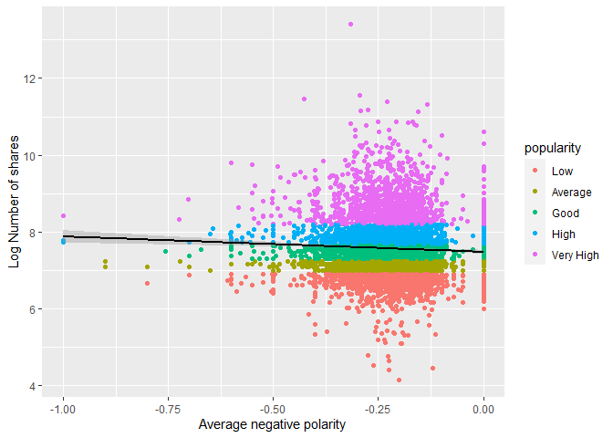

Project 3: Predicting online news popularity
================
Rohan Prabhune, Manan Shah

-   <a href="#introduction" id="toc-introduction">Introduction</a>
-   <a href="#loading-the-necessary-packages"
    id="toc-loading-the-necessary-packages">Loading the necessary
    packages</a>
-   <a href="#reading-the-data" id="toc-reading-the-data">Reading the
    data:</a>
-   <a href="#pre-processing" id="toc-pre-processing">Pre-processing:</a>
    -   <a href="#subset-data-based-on-type-of-article"
        id="toc-subset-data-based-on-type-of-article">Subset data based on type
        of article</a>
    -   <a href="#spliting-the-data-into-train-and-test-set"
        id="toc-spliting-the-data-into-train-and-test-set">Spliting the data
        into train and test set</a>
-   <a href="#summarizations" id="toc-summarizations">Summarizations</a>
    -   <a href="#summary-tables" id="toc-summary-tables">Summary tables</a>
    -   <a href="#contingency-tables" id="toc-contingency-tables">Contingency
        tables</a>
    -   <a href="#plots" id="toc-plots">Plots</a>
-   <a href="#modeling" id="toc-modeling">Modeling</a>
    -   <a href="#linear-regression" id="toc-linear-regression">Linear
        regression</a>
        -   <a href="#forward-selection" id="toc-forward-selection">Forward
            Selection</a>
        -   <a href="#backward-selection" id="toc-backward-selection">Backward
            Selection</a>
    -   <a href="#ensemble-tree-based-models"
        id="toc-ensemble-tree-based-models">Ensemble Tree-Based Models</a>
        -   <a href="#random-forest" id="toc-random-forest">Random Forest</a>
        -   <a href="#boosting" id="toc-boosting">Boosting</a>
-   <a href="#model-evaluation-on-test-set"
    id="toc-model-evaluation-on-test-set">Model evaluation on test set</a>

# Introduction

The data set describes the features of each individual channel. The
purpose of the analysis is to predict the performance of each individual
channel.

# Loading the necessary packages

``` r
library(tidyverse)
library(caret)
library(kableExtra)
library(corrplot)
library(timereg)
```

# Reading the data:

*Citation for the dataset:  
K. Fernandes, P. Vinagre and P. Cortez. A Proactive Intelligent Decision
Support System for Predicting the Popularity of Online News. Proceedings
of the 17th EPIA 2015 - Portuguese Conference on Artificial
Intelligence, September, Coimbra, Portugal.*

``` r
# Reading the data
dataset <- read_csv("data/OnlineNewsPopularity.csv",show_col_types=FALSE) 
dataset
```

# Pre-processing:

## Subset data based on type of article

Here, `remaining_cols` is used to store the column names other than the
**data_channel_is\_** columns. These will be appended to the column
selected for the type of channel. We get the appended result in
`subset_cols`. The dataset is then filtered on the columns in
subset_cols and where the data_channel_is\_\* column values are 1.

``` r
# Vector of columns other than data_channel_is*
remaining_cols = c(names(dataset))[c(1:13,20:61)]
# Subset based on type of article
input_data_channel = params$var
select_var = paste0("data_channel_is_",input_data_channel)
subset_cols = append(remaining_cols,select_var)
# Subset data
df <- dataset %>% select(all_of(subset_cols)) %>%
  filter(dataset[select_var] == 1) %>%
  select(all_of(remaining_cols))
```

Removing url and timedelta as they are non-predictive variables. Filter
the tibble based on n_tokens_content and n_tokens_title that is, where
number of words in the content and title are not zero.

``` r
# Remove url and timedelta and filter on data
df <- df %>% select(-url,-timedelta) %>% filter(n_tokens_content!=0,n_tokens_title!=0)
df
# Column names
names(df)
```

    ##  [1] "n_tokens_title"               "n_tokens_content"            
    ##  [3] "n_unique_tokens"              "n_non_stop_words"            
    ##  [5] "n_non_stop_unique_tokens"     "num_hrefs"                   
    ##  [7] "num_self_hrefs"               "num_imgs"                    
    ##  [9] "num_videos"                   "average_token_length"        
    ## [11] "num_keywords"                 "kw_min_min"                  
    ## [13] "kw_max_min"                   "kw_avg_min"                  
    ## [15] "kw_min_max"                   "kw_max_max"                  
    ## [17] "kw_avg_max"                   "kw_min_avg"                  
    ## [19] "kw_max_avg"                   "kw_avg_avg"                  
    ## [21] "self_reference_min_shares"    "self_reference_max_shares"   
    ## [23] "self_reference_avg_sharess"   "weekday_is_monday"           
    ## [25] "weekday_is_tuesday"           "weekday_is_wednesday"        
    ## [27] "weekday_is_thursday"          "weekday_is_friday"           
    ## [29] "weekday_is_saturday"          "weekday_is_sunday"           
    ## [31] "is_weekend"                   "LDA_00"                      
    ## [33] "LDA_01"                       "LDA_02"                      
    ## [35] "LDA_03"                       "LDA_04"                      
    ## [37] "global_subjectivity"          "global_sentiment_polarity"   
    ## [39] "global_rate_positive_words"   "global_rate_negative_words"  
    ## [41] "rate_positive_words"          "rate_negative_words"         
    ## [43] "avg_positive_polarity"        "min_positive_polarity"       
    ## [45] "max_positive_polarity"        "avg_negative_polarity"       
    ## [47] "min_negative_polarity"        "max_negative_polarity"       
    ## [49] "title_subjectivity"           "title_sentiment_polarity"    
    ## [51] "abs_title_subjectivity"       "abs_title_sentiment_polarity"
    ## [53] "shares"

## Spliting the data into train and test set

The entire data set is divided into training and testing data set. This
is done in order to perform exploratory data analysis and modelling on
train data and later evaluate the performance on the unseen test data.

``` r
set.seed(52)
# Get the indexes for training data
train_size <- sample(nrow(df), nrow(df)*0.7)
# Get training data
train_df <- df[train_size,]
# Get test data
test_df <- df[-train_size,] 
```

# Summarizations

## Summary tables

Here, the column wise summary of important variables such as number of
images, number of videos, number of unique tokens etc. is generated for
the train data. This helps us evaluate the distribution of the
variables.

``` r
# Creating summaries for some numerical variables
df_summary <- train_df %>%
  select(num_imgs,num_videos,num_hrefs,n_unique_tokens, num_videos,num_keywords,
         global_rate_positive_words,global_rate_negative_words)
predictor_table <- apply(df_summary, MARGIN = 2,FUN = summary, na.rm = TRUE)
predictor_table %>%
  kbl(caption="Summary table for predictor variables") %>%
  kable_classic(full_width = F)
```

<table class=" lightable-classic" style="font-family: &quot;Arial Narrow&quot;, &quot;Source Sans Pro&quot;, sans-serif; width: auto !important; margin-left: auto; margin-right: auto;">
<caption>
Summary table for predictor variables
</caption>
<thead>
<tr>
<th style="text-align:left;">
</th>
<th style="text-align:right;">
num_imgs
</th>
<th style="text-align:right;">
num_videos
</th>
<th style="text-align:right;">
num_hrefs
</th>
<th style="text-align:right;">
n_unique_tokens
</th>
<th style="text-align:right;">
num_keywords
</th>
<th style="text-align:right;">
global_rate_positive_words
</th>
<th style="text-align:right;">
global_rate_negative_words
</th>
</tr>
</thead>
<tbody>
<tr>
<td style="text-align:left;">
Min.
</td>
<td style="text-align:right;">
0.000000
</td>
<td style="text-align:right;">
0.0000000
</td>
<td style="text-align:right;">
0.000000
</td>
<td style="text-align:right;">
0.1554404
</td>
<td style="text-align:right;">
2.000000
</td>
<td style="text-align:right;">
0.0000000
</td>
<td style="text-align:right;">
0.0000000
</td>
</tr>
<tr>
<td style="text-align:left;">
1st Qu.
</td>
<td style="text-align:right;">
1.000000
</td>
<td style="text-align:right;">
0.0000000
</td>
<td style="text-align:right;">
5.000000
</td>
<td style="text-align:right;">
0.4596297
</td>
<td style="text-align:right;">
7.000000
</td>
<td style="text-align:right;">
0.0331126
</td>
<td style="text-align:right;">
0.0087079
</td>
</tr>
<tr>
<td style="text-align:left;">
Median
</td>
<td style="text-align:right;">
1.000000
</td>
<td style="text-align:right;">
0.0000000
</td>
<td style="text-align:right;">
7.000000
</td>
<td style="text-align:right;">
0.5326877
</td>
<td style="text-align:right;">
8.000000
</td>
<td style="text-align:right;">
0.0416667
</td>
<td style="text-align:right;">
0.0136986
</td>
</tr>
<tr>
<td style="text-align:left;">
Mean
</td>
<td style="text-align:right;">
4.464599
</td>
<td style="text-align:right;">
0.4398284
</td>
<td style="text-align:right;">
9.439243
</td>
<td style="text-align:right;">
0.5321695
</td>
<td style="text-align:right;">
7.805149
</td>
<td style="text-align:right;">
0.0429250
</td>
<td style="text-align:right;">
0.0144813
</td>
</tr>
<tr>
<td style="text-align:left;">
3rd Qu.
</td>
<td style="text-align:right;">
6.000000
</td>
<td style="text-align:right;">
1.0000000
</td>
<td style="text-align:right;">
11.000000
</td>
<td style="text-align:right;">
0.6013072
</td>
<td style="text-align:right;">
9.000000
</td>
<td style="text-align:right;">
0.0516273
</td>
<td style="text-align:right;">
0.0189824
</td>
</tr>
<tr>
<td style="text-align:left;">
Max.
</td>
<td style="text-align:right;">
65.000000
</td>
<td style="text-align:right;">
59.0000000
</td>
<td style="text-align:right;">
119.000000
</td>
<td style="text-align:right;">
0.9000000
</td>
<td style="text-align:right;">
10.000000
</td>
<td style="text-align:right;">
0.1521739
</td>
<td style="text-align:right;">
0.0861678
</td>
</tr>
</tbody>
</table>

This table helps us understand the numerical summary for the response
variable. From this we can find out minimum, maximum, median and
quantile values for the response variable.

``` r
response_table <- as.array(summary(train_df$shares))
response_table %>%
  kbl(caption="Summary table for response variable") %>%
  kable_classic(full_width = F)
```

<table class=" lightable-classic" style="font-family: &quot;Arial Narrow&quot;, &quot;Source Sans Pro&quot;, sans-serif; width: auto !important; margin-left: auto; margin-right: auto;">
<caption>
Summary table for response variable
</caption>
<thead>
<tr>
<th style="text-align:left;">
Var1
</th>
<th style="text-align:right;">
Freq
</th>
</tr>
</thead>
<tbody>
<tr>
<td style="text-align:left;">
Min.
</td>
<td style="text-align:right;">
64.000
</td>
</tr>
<tr>
<td style="text-align:left;">
1st Qu.
</td>
<td style="text-align:right;">
1100.000
</td>
</tr>
<tr>
<td style="text-align:left;">
Median
</td>
<td style="text-align:right;">
1700.000
</td>
</tr>
<tr>
<td style="text-align:left;">
Mean
</td>
<td style="text-align:right;">
3095.033
</td>
</tr>
<tr>
<td style="text-align:left;">
3rd Qu.
</td>
<td style="text-align:right;">
3000.000
</td>
</tr>
<tr>
<td style="text-align:left;">
Max.
</td>
<td style="text-align:right;">
663600.000
</td>
</tr>
</tbody>
</table>

## Contingency tables

The training data already has dummy variables generated. The variable
weekday\_ is\_\* is grouped into day and a two way contingency table of
day vs number of keywords is generated. The number of images is
converted into categorical variable from a quantitative variable and a
two way contigency table of day vs image grouped is created.

``` r
# Create a categorical "day" column
train_df$day <- ifelse(train_df$weekday_is_monday == 1, "Mon",
                ifelse(train_df$weekday_is_tuesday == 1, "Tues",
                ifelse(train_df$weekday_is_wednesday == 1, "Wed", 
                ifelse(train_df$weekday_is_thursday == 1, "Thurs",
                ifelse(train_df$weekday_is_friday == 1, "Fri",
                ifelse(train_df$weekday_is_saturday == 1, "Sat",
                ifelse(train_df$weekday_is_sunday == 1, "Sun","NA")))))))
train_df$day <- ordered(as.factor(train_df$day),
                        levels = c("Mon","Tues","Wed","Thurs","Fri","Sat","Sun"))

# Create a categorical "image_grouped" column
train_df$image_grouped <- ifelse(train_df$num_imgs %in% c(0:25), "1-25",
                          ifelse(train_df$num_imgs %in% c(26:50), "26-50",
                          ifelse(train_df$num_imgs %in% c(51:75), "51-75",
                          ifelse(train_df$num_imgs %in% c(76:101), "76-100","100+"))))
train_df$image_grouped <- ordered(as.factor(train_df$image_grouped),
                        levels = c("1-25","26-50","51-75","76-100","100+"))

# Contingency table between day and image_grouped
contingency_1 <- table(train_df$day,train_df$image_grouped)
contingency_1 %>%
  kbl(caption="Table for Days and Number of Images") %>%
  kable_classic(full_width = F)
```

<table class=" lightable-classic" style="font-family: &quot;Arial Narrow&quot;, &quot;Source Sans Pro&quot;, sans-serif; width: auto !important; margin-left: auto; margin-right: auto;">
<caption>
Table for Days and Number of Images
</caption>
<thead>
<tr>
<th style="text-align:left;">
</th>
<th style="text-align:right;">
1-25
</th>
<th style="text-align:right;">
26-50
</th>
<th style="text-align:right;">
51-75
</th>
<th style="text-align:right;">
76-100
</th>
<th style="text-align:right;">
100+
</th>
</tr>
</thead>
<tbody>
<tr>
<td style="text-align:left;">
Mon
</td>
<td style="text-align:right;">
824
</td>
<td style="text-align:right;">
38
</td>
<td style="text-align:right;">
1
</td>
<td style="text-align:right;">
0
</td>
<td style="text-align:right;">
0
</td>
</tr>
<tr>
<td style="text-align:left;">
Tues
</td>
<td style="text-align:right;">
1004
</td>
<td style="text-align:right;">
18
</td>
<td style="text-align:right;">
2
</td>
<td style="text-align:right;">
0
</td>
<td style="text-align:right;">
0
</td>
</tr>
<tr>
<td style="text-align:left;">
Wed
</td>
<td style="text-align:right;">
950
</td>
<td style="text-align:right;">
23
</td>
<td style="text-align:right;">
0
</td>
<td style="text-align:right;">
0
</td>
<td style="text-align:right;">
0
</td>
</tr>
<tr>
<td style="text-align:left;">
Thurs
</td>
<td style="text-align:right;">
894
</td>
<td style="text-align:right;">
21
</td>
<td style="text-align:right;">
0
</td>
<td style="text-align:right;">
0
</td>
<td style="text-align:right;">
0
</td>
</tr>
<tr>
<td style="text-align:left;">
Fri
</td>
<td style="text-align:right;">
671
</td>
<td style="text-align:right;">
10
</td>
<td style="text-align:right;">
0
</td>
<td style="text-align:right;">
0
</td>
<td style="text-align:right;">
0
</td>
</tr>
<tr>
<td style="text-align:left;">
Sat
</td>
<td style="text-align:right;">
381
</td>
<td style="text-align:right;">
6
</td>
<td style="text-align:right;">
0
</td>
<td style="text-align:right;">
0
</td>
<td style="text-align:right;">
0
</td>
</tr>
<tr>
<td style="text-align:left;">
Sun
</td>
<td style="text-align:right;">
279
</td>
<td style="text-align:right;">
5
</td>
<td style="text-align:right;">
0
</td>
<td style="text-align:right;">
0
</td>
<td style="text-align:right;">
0
</td>
</tr>
</tbody>
</table>

``` r
# Contingency table between day and num_keywords
contingency_2 <- table(as.factor(train_df$day), as.factor(train_df$num_keywords))
contingency_2 %>%
  kbl(caption="Table for Days and Number of Keywords") %>%
  kable_classic(full_width = F)
```

<table class=" lightable-classic" style="font-family: &quot;Arial Narrow&quot;, &quot;Source Sans Pro&quot;, sans-serif; width: auto !important; margin-left: auto; margin-right: auto;">
<caption>
Table for Days and Number of Keywords
</caption>
<thead>
<tr>
<th style="text-align:left;">
</th>
<th style="text-align:right;">
2
</th>
<th style="text-align:right;">
3
</th>
<th style="text-align:right;">
4
</th>
<th style="text-align:right;">
5
</th>
<th style="text-align:right;">
6
</th>
<th style="text-align:right;">
7
</th>
<th style="text-align:right;">
8
</th>
<th style="text-align:right;">
9
</th>
<th style="text-align:right;">
10
</th>
</tr>
</thead>
<tbody>
<tr>
<td style="text-align:left;">
Mon
</td>
<td style="text-align:right;">
2
</td>
<td style="text-align:right;">
4
</td>
<td style="text-align:right;">
13
</td>
<td style="text-align:right;">
63
</td>
<td style="text-align:right;">
136
</td>
<td style="text-align:right;">
154
</td>
<td style="text-align:right;">
166
</td>
<td style="text-align:right;">
126
</td>
<td style="text-align:right;">
199
</td>
</tr>
<tr>
<td style="text-align:left;">
Tues
</td>
<td style="text-align:right;">
0
</td>
<td style="text-align:right;">
7
</td>
<td style="text-align:right;">
20
</td>
<td style="text-align:right;">
60
</td>
<td style="text-align:right;">
143
</td>
<td style="text-align:right;">
219
</td>
<td style="text-align:right;">
175
</td>
<td style="text-align:right;">
150
</td>
<td style="text-align:right;">
250
</td>
</tr>
<tr>
<td style="text-align:left;">
Wed
</td>
<td style="text-align:right;">
1
</td>
<td style="text-align:right;">
6
</td>
<td style="text-align:right;">
24
</td>
<td style="text-align:right;">
74
</td>
<td style="text-align:right;">
148
</td>
<td style="text-align:right;">
208
</td>
<td style="text-align:right;">
149
</td>
<td style="text-align:right;">
162
</td>
<td style="text-align:right;">
201
</td>
</tr>
<tr>
<td style="text-align:left;">
Thurs
</td>
<td style="text-align:right;">
0
</td>
<td style="text-align:right;">
3
</td>
<td style="text-align:right;">
21
</td>
<td style="text-align:right;">
79
</td>
<td style="text-align:right;">
126
</td>
<td style="text-align:right;">
196
</td>
<td style="text-align:right;">
165
</td>
<td style="text-align:right;">
148
</td>
<td style="text-align:right;">
177
</td>
</tr>
<tr>
<td style="text-align:left;">
Fri
</td>
<td style="text-align:right;">
0
</td>
<td style="text-align:right;">
5
</td>
<td style="text-align:right;">
18
</td>
<td style="text-align:right;">
60
</td>
<td style="text-align:right;">
105
</td>
<td style="text-align:right;">
121
</td>
<td style="text-align:right;">
143
</td>
<td style="text-align:right;">
86
</td>
<td style="text-align:right;">
143
</td>
</tr>
<tr>
<td style="text-align:left;">
Sat
</td>
<td style="text-align:right;">
0
</td>
<td style="text-align:right;">
3
</td>
<td style="text-align:right;">
7
</td>
<td style="text-align:right;">
16
</td>
<td style="text-align:right;">
28
</td>
<td style="text-align:right;">
74
</td>
<td style="text-align:right;">
75
</td>
<td style="text-align:right;">
67
</td>
<td style="text-align:right;">
117
</td>
</tr>
<tr>
<td style="text-align:left;">
Sun
</td>
<td style="text-align:right;">
0
</td>
<td style="text-align:right;">
2
</td>
<td style="text-align:right;">
4
</td>
<td style="text-align:right;">
17
</td>
<td style="text-align:right;">
27
</td>
<td style="text-align:right;">
44
</td>
<td style="text-align:right;">
47
</td>
<td style="text-align:right;">
53
</td>
<td style="text-align:right;">
90
</td>
</tr>
</tbody>
</table>

## Plots

#### Response variable analysis

The histogram below helps in understanding the distribution of the
response variable. If the histogram is centered around the mean, then we
can say that the distribution is normal. However if it is to the left or
the right, then we can infer that the distribution is skewed in which
case we can consider log of the response variable to estimate the linear
model.

``` r
ggplot(train_df,aes(shares)) + 
  geom_histogram(fill='darkred')
```


``` r
# Creating categorical form of response variable
train_df$popularity <-qcut(train_df$shares,
                           cuts=5,
                           label=c('Low','Average','Good','High','Very High'))
```

#### Number of shares per day

``` r
data_plot_1 <- train_df %>% 
  select(day, shares) %>% 
  group_by(day) %>% 
  summarise(Num_Of_Shares = sum(shares))

ggplot(data = data_plot_1, aes(day, Num_Of_Shares)) + 
  labs(x="Days of Week",y="Number OF Shares",title="Number of shares per day") + 
  geom_col(fill="steelblue",width=0.5)+
  theme(plot.title = element_text(hjust = 0.5))
```


#### Number of shares per number of keywords in metadata

``` r
data_plot_2 <- train_df %>% 
  select(shares, num_keywords,popularity)

ggplot(data_plot_2, aes(num_keywords, shares)) + 
  geom_point() + 
  geom_jitter(aes(col = shares))+
  labs(x="Number of keywords in metadata",y="Number OF Shares")
```


#### Average number of shares per words in title

``` r
data_plot_3 <- train_df %>% 
  select(n_tokens_title, shares) %>% 
  group_by(n_tokens_title) %>% 
  summarise(mean_token_title = mean(shares))

ggplot(data_plot_3, aes(n_tokens_title, mean_token_title)) + 
  geom_line() +
  labs(x="Number of words in the title",y="Average number of shares")
```


#### Sentiment plots

These plots attempt to find the trend of log of shares as a function of
average positive and average negative polarity. If we see that the
number of shares increases or decrease with the increase in the polarity
of the content, then we can infer the trend from the slope of the linear
regression line on the plots given below.

``` r
ggplot(train_df, aes(avg_positive_polarity,log(shares)))+ 
  geom_point(aes(color=popularity)) + 
  geom_smooth(method="lm",color='black')+
  labs(x="Average positive polarity",y="Log Number of shares")
```


``` r
ggplot(train_df, aes(avg_negative_polarity,log(shares)))+ 
  geom_point(aes(color=popularity)) + 
  geom_smooth(method="lm",color='black')+
  labs(x="Average negative polarity",y="Log Number of shares")
```



#### Correlation plot

This plot is used to identify the highly correlated predictor variables.
A big blue dot signifies variables having high positive correlation
while a big red dot signifies a high negative correlation. This plots
helps in removing the highly correlated variables from the model as
including them will increase the variability in prediction.

``` r
all_corr = cor(select_if(train_df, is.numeric), method = c("spearman"))
correlated_varaibles <- findCorrelation(all_corr,cutoff = 0.8,
                                        verbose=FALSE,names=TRUE,exact=TRUE)


corr_data1 <- train_df %>% select(all_of(correlated_varaibles))
corr1 = cor(corr_data1,method = c("spearman"))
corrplot(corr1,diag=FALSE)
```


<!---------------------------------------------------------------------------->

# Modeling

#### Variable selection

First the variables which were added as a part of exploratory data
analysis were removed. Following that, the variables which are highly
correlated are removed. These are the variables which are highly
correlated in all the six subsets (based on the data_channel_is\*
values).

``` r
# Removing newly added variables for EDA
train_df2 <- train_df %>% select(-day,-image_grouped,-popularity,-is_weekend)
# Removing highly correlated variables
train_df2 <- train_df2 %>% select(-n_non_stop_words,-kw_min_max,
                                  -self_reference_max_shares,-rate_positive_words,
                                  -n_unique_tokens,-global_rate_negative_words,
                                  -kw_min_min,-kw_avg_min,
                                  -self_reference_avg_sharess)
```

#### Correlation plot after removing highly correlated variables

This plot is used to confirm if we no longer have highly correlated
variables in our dataset before we fit different models on the data.

``` r
all_corr2 = cor(select_if(train_df2, is.numeric), method = c("spearman"))
correlated_varaibles2 <- findCorrelation(all_corr2,cutoff = 0.8,
                                        verbose=FALSE,names=TRUE,exact=TRUE)

if (length(correlated_varaibles2) > 1) { 
  corr_data2 <- train_df2 %>% select(all_of(correlated_varaibles2))
  corr2 = cor(corr_data2,method = c("spearman"))
  corrplot(corr2,diag=FALSE)
}else {
  print("Not enough variables above threshold value to generate a correlation plot")
}
```

    ## [1] "Not enough variables above threshold value to generate a correlation plot"

## Linear regression

### Forward Selection

``` r
set.seed(111)

tr_ctrl <- trainControl(method = "repeatedcv")
lm_forward_fit <- train(shares ~ ., data = train_df2,
                        preProcess = c("center", "scale"),
                        method = "leapForward",
                        tuneGrid = expand.grid(nvmax = seq(1,42,2)),
                        trControl = tr_ctrl)
```

### Backward Selection

``` r
set.seed(111)

tr_ctrl <- trainControl(method = "repeatedcv",number=3)
lm_backward_fit <- train(shares ~ ., data = train_df2,
                        preProcess = c("center", "scale"),
                        method = "leapBackward",
                        tuneGrid = expand.grid(nvmax = seq(1,42,2)),
                        trControl = tr_ctrl)
```

## Ensemble Tree-Based Models

### Random Forest

#### PCA

``` r
set.seed(111)
# Get the principal components
PC <- prcomp(select(train_df2,-shares),scale = TRUE)
#Screenplot
screeplot(PC,npcs=length(PC$sdev),type = "lines")
```


#### Training

``` r
pca_train_data <- as_tibble(predict(PC,select(train_df2,-shares))) %>%
  select(PC1:PC10) %>% 
  bind_cols(select(train_df2,shares))

rfFit <- train(shares ~ ., data = pca_train_data,
               method = "rf",
               trControl = trainControl(method = "repeatedcv",number = 3),
               tuneGrid = data.frame(mtry = ncol(pca_train_data)/3)) 
```

### Boosting

``` r
set.seed(111)
boost_fit <- train(shares ~ .,data = train_df2,
                   method = 'gbm',
                   preProcess = c("center", "scale"),
                   trControl = tr_ctrl,
                   verbose = FALSE)
```

# Model evaluation on test set

#### Forward selection

``` r
# Forward Selection
lm_forward_pred <- predict(lm_forward_fit,newdata=select(test_df,-shares))
forward_rmse <- sqrt(mean((lm_forward_pred-test_df$shares)^2))
postResample(lm_forward_pred,test_df$shares)
```

    ##         RMSE     Rsquared          MAE 
    ## 4.026692e+03 1.535103e-02 2.258218e+03

#### Backward Selection

``` r
# Backward Selection
lm_backward_pred <- predict(lm_backward_fit,newdata=select(test_df,-shares))
backward_rmse <- sqrt(mean((lm_backward_pred-test_df$shares)^2))
postResample(lm_backward_pred,test_df$shares)
```

    ##         RMSE     Rsquared          MAE 
    ## 4.026132e+03 2.961436e-02 2.233183e+03

#### Random Forest

``` r
#Random Forest
pca_test_data <- as_tibble(predict(PC,select(test_df,-shares))) %>%
  select(PC1:PC10)

rfPred <- predict(rfFit, newdata = pca_test_data,type = "raw")
rf_rmse <- sqrt(mean((rfPred-test_df$shares)^2))
postResample(rfPred,test_df$shares)
```

    ##         RMSE     Rsquared          MAE 
    ## 4.481192e+03 1.528009e-03 2.456021e+03

#### Boosted Tree

``` r
# Boosted Tree
boosted_pred <- predict(boost_fit,newdata=select(test_df,-shares))
boosted_rmse <- sqrt(mean((boosted_pred-test_df$shares)^2))
postResample(boosted_pred,test_df$shares)
```

    ##         RMSE     Rsquared          MAE 
    ## 4.356542e+03 3.601987e-03 2.298204e+03

#### Model evaluation

``` r
model_method <- c("Forward Selection", "Backward Selection", "Random Forest", "Boosted Tree")
model_rmse <- c(forward_rmse, backward_rmse, rf_rmse, boosted_rmse)

model_result <- data.frame(model_method, model_rmse)

winner <- paste("The winner that is best model among all is ", model_result[which.min(model_result$model_rmse), 1], " as it has lowest RMSE value of ", round(min(model_result$model_rmse), 2))
winner
```

    ## [1] "The winner that is best model among all is  Backward Selection  as it has lowest RMSE value of  4026.13"
